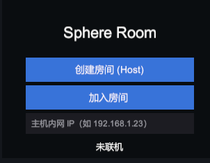
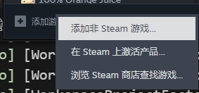
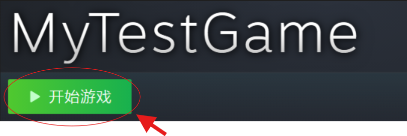

# Sphere Room — 1~4 人 Host 模式联机 Demo

- Unity **6000.3.14f1** · URP · Windows Standalone x64
- 网络：**FishNet 4.7.3**，Host-Client（listen server），**无专用服务器、无 Host Migration**
- TickRate **50 Hz**，`Time.fixedDeltaTime = 0.02` —— 1 Tick 恰好 1 个物理步，网络与物理完全对齐

---

## 怎么跑

**构建产物在仓库的 `Build/` 目录**（约 101 MB），直接进 `Build/` 双击 `MyTestGame.exe` 即可，不用自己打包。
发给别人时**整个 `Build` 文件夹一起压缩**（exe + `MyTestGame_Data` + `UnityPlayer.dll` + `MonoBleedingEdge` + `steam_appid.txt`，缺一不可）。

### 方式 A：局域网直连（不需要 Steam）

1. 主机点「创建房间」→ 界面左上角显示 **「本机内网 IP：192.168.x.x」**
2. 好友在地址框填这个 IP → 点「加入房间」

3. 如果不输入ip默认进入回环地址

Steam 没开也能这样玩：Steam 传输初始化失败时只是自己停用，不影响局域网通道。

### 方式 B：Steam 邀请（跨网络）

1. 两边登录**不同且互为好友**的 Steam 账号，**都先通过手动启动 exe**
2. 把 exe 加进 Steam 库：Steam → 添加游戏 → 添加非 Steam 游戏 → 选 `MyTestGame.exe`，**以后从库里启动(通过库里)**（这样 Steam Overlay 才会注入，邀请弹窗才会出来）

3. 主机点「创建房间」→ 点「邀请 Steam 好友」→ 弹 Overlay 好友列表 → 选人发送。【如果被邀请者点击之后没法进入游戏则需要通过库提前打开游戏进程】
4. 对方接受后自动进房；也可在 Steam 好友列表右键主机 →「加入游戏」

本项目用公共测试 AppID **480（Spacewar）**，所有 Steam 账号自动拥有。副作用：好友列表里双方都显示"正在玩 Spacewar"，属预期行为。

### 其他游玩方式：可邀请steam好友和局域网内好友共同游玩

---

## 网络方案与理由

| 决策 | 选择 | 理由 |
|---|---|---|
| 框架 | **FishNet 4** | 内建预测/和解（Prediction + Reconcile）、Tick 驱动、物理场景管理|
| 传输 | **Multipass 并存**：Tugboat(LAN/UDP) + FishySteamworks(Steam P2P) | 一个包同时支持内网与跨网络；主机 `GlobalServerActions` 同时监听两条，客户端各自选一条。替换掉 Tugboat 会废掉 ParrelSync 双开回归回路 |
| 权威 | **Host 唯一数据源** | 球的物理、生成销毁、撞击判定全在服务器；客户端只做采集输入、本地预测、接受和解 |
| 时间 | `TimeManager` Tick 驱动，物理 `Simulation Mode = Script` | 不用 `Update`/`Time.time` 做任何网络计时，确定性可复现 |

## 双人对撞为什么不错位

- **球**：`Rigidbody` + `PredictionRigidbody`，服务器每 Tick 下发速度/角速度做 reconcile，客户端本地模拟后接受修正；图形层对**位置和旋转都做平滑**（只平滑位置会让足球纹路看着打滑）。
- **玩家**：刻意用 **Kinematic Rigidbody + 自写 `Physics.CapsuleCast` sweep**，而不是 Dynamic 或 `CharacterController`。Kinematic 不受力、不吃重力，语义就是"会走的墙"，球撞不动玩家，穿墙由自己的 sweep 独断（PhysX 默认不为 kinematic-static 生成接触，不能指望它挡人）。推球交给 kinematic-dynamic。
- 同一 Tick 内两人同时撞球时，两个输入都在服务器同一个物理步里结算，只产生**一个**权威状态再下发，客户端因此不会分叉。

